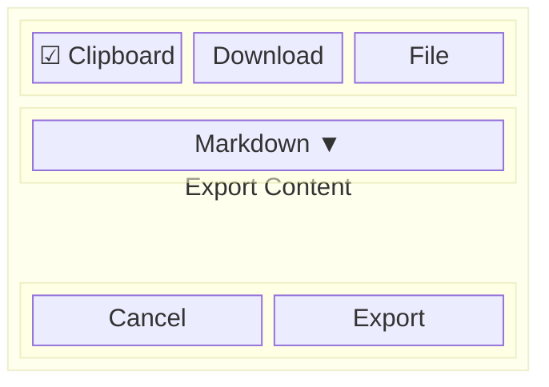
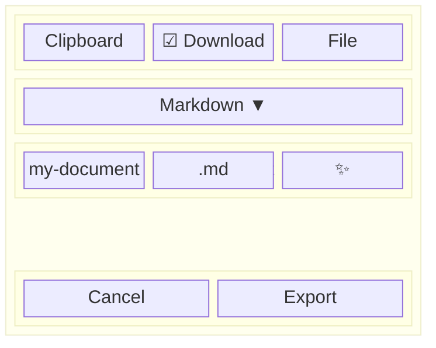
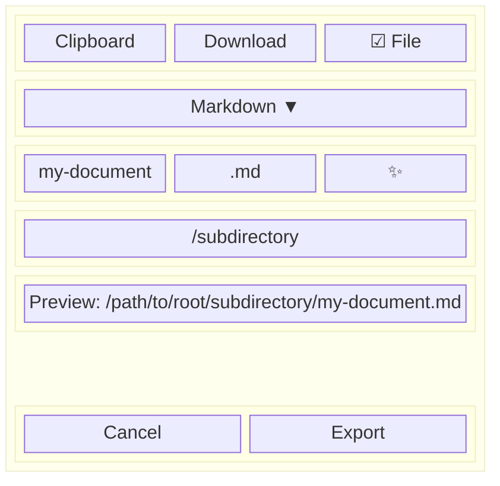
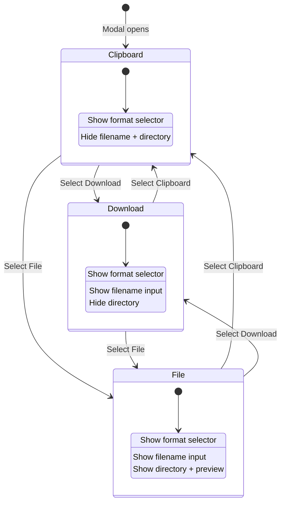

# Feature: export-content-locally

## Samenvatting
De Export Content modal in de Quill editor uitbreiden met een "Download" optie, zodat gebruikers content als bestand naar hun lokale filesystem kunnen downloaden via de browser, naast de bestaande "Clipboard" en "File" (server) opties.

## User story
The "export content" function in the Quill editor can now only export to the project root on the server. We also want the option to save to the local filesystem. For the "Import content" we do something similar. We can follow that pattern.

## Functionele requirements

### FR-1: Download destination optie
- Beschrijving: Een derde destination optie "Download" toevoegen aan de export modal, naast "Clipboard" en "File" (server)
- Acceptatiecriteria:
  - [ ] Radio button "Download" (met `bi-download` icon) verschijnt tussen "Clipboard" en "File" in de btn-group
  - [ ] "Download" optie is altijd beschikbaar (geen project root_directory vereist)
  - [ ] "File" optie behoudt bestaand gedrag (disabled zonder project root)

### FR-2: Filename input bij Download
- Beschrijving: Bij selectie van "Download" wordt een filename input getoond zodat de gebruiker de bestandsnaam kan kiezen
- Acceptatiecriteria:
  - [ ] Filename input wordt getoond bij "Download" destination
  - [ ] Filename wordt vooraf ingevuld met entity name (bestaand gedrag)
  - [ ] Extensie past zich aan op basis van gekozen format
  - [ ] "Suggest name" knop werkt bij Download destination
  - [ ] Directory selector wordt NIET getoond bij "Download" (alleen bij "File")

### FR-3: Browser download uitvoeren
- Beschrijving: Bij klikken op "Export" met "Download" destination wordt content geconverteerd en als bestand gedownload via de browser
- Acceptatiecriteria:
  - [ ] Content wordt geconverteerd via bestaand `/note/convert-format` endpoint
  - [ ] Geconverteerde content wordt als browser download aangeboden
  - [ ] Bestand krijgt juiste naam (filename + extensie)
  - [ ] Na succesvolle download sluit de modal en verschijnt een success toast
  - [ ] Bij fout verschijnt een error melding in de modal

### FR-4: Bestaande functionaliteit behouden
- Beschrijving: Clipboard en File (server) export blijven ongewijzigd functioneren
- Acceptatiecriteria:
  - [ ] Clipboard export werkt identiek als voorheen
  - [ ] File (server) export werkt identiek als voorheen
  - [ ] Overwrite warning werkt nog steeds bij File export

## Gebruikersflow

1. Gebruiker klikt op "Export Content" knop in Quill toolbar
2. Export modal opent met "Clipboard" als default selectie
3. Gebruiker selecteert "Download" radio button
4. Filename input verschijnt met vooraf ingevulde naam en extensie
5. Gebruiker past optioneel filename en/of format aan
6. Gebruiker klikt "Export"
7. Browser triggert een download van het geconverteerde bestand
8. Modal sluit, toast melding "Downloaded filename.ext" verschijnt

## Edge cases

| Case | Gedrag |
|------|--------|
| Lege editor content | Export knop toont fout "No content to export" (bestaand gedrag via getContent) |
| Lege filename | Validatie error "Filename is required" |
| Speciale tekens in filename | Gesanitized via bestaande `sanitizeFilename()` functie |
| Grote content (>1MB) | Browser download handelt dit af; geen extra limiet |
| Browser zonder Blob support | Fallback niet nodig — ES2019+ is projectstandaard |
| Format conversie faalt | Error melding in modal alert |
| Modal geopend zonder getContent | Error melding "No content provider configured" (bestaand) |
| Dubbele klik op Export | Export knop disabled + spinner tijdens verwerking (bestaand patroon) |
| Netwerk fout tijdens conversie | Catch block toont error melding in modal alert |

## Entiteiten en relaties

### Bestaande entiteiten
- **CopyType enum** — definieert export formats (md, text, html, quilldelta, llm-xml)
- **CopyFormatConverter service** — converteert Quill Delta naar diverse formats
- **NoteController::actionConvertFormat** — AJAX endpoint voor format conversie

### Nieuwe/gewijzigde componenten

| Component | Type | Locatie | Wijziging |
|-----------|------|---------|-----------|
| Export modal view | View/JS | `yii/views/layouts/_export-modal.php` | Wijzigen: derde radio button "Download" toevoegen, JS voor download logica |

## Herbruikbare componenten

| Component | Locatie | Hoe hergebruikt |
|-----------|---------|-----------------|
| Export modal | `yii/views/layouts/_export-modal.php` | Uitbreiden met Download optie |
| EXTENSION_MAP | `_export-modal.php` JS | Hergebruiken voor download bestandsnaam |
| sanitizeFilename() | `_export-modal.php` JS | Hergebruiken voor filename validatie |
| `/note/convert-format` endpoint | `NoteController.php` | Hergebruiken voor Quill Delta → format conversie |
| Suggest name endpoint | `/claude/suggest-name` | Hergebruiken voor AI filename suggestie |
| Format dropdown | `_export-modal.php` | Bestaand element, ongewijzigd |
| Toast notifications | `QuillToolbar.showToast()` | Hergebruiken voor feedback |

## Architectuurbeslissingen

| Beslissing | Rationale |
|------------|-----------|
| Puur frontend download (Blob) | Geen server-side file write nodig — content wordt al geconverteerd via bestaand endpoint |
| Hergebruik `/note/convert-format` | Geen nieuw endpoint nodig — conversie logica bestaat al |
| Geen nieuwe PHP bestanden | Alle wijzigingen in bestaande `_export-modal.php` view |
| Filename sectie splitsen van directory sectie | Download heeft filename nodig maar geen directory; File heeft beide nodig |

## Open vragen
- Geen

## UI/UX overwegingen

### Layout/Wireframe

#### State 1: Clipboard geselecteerd (default)

#### State 2: Download geselecteerd

#### State 3: File geselecteerd

#### Destination state flow

### UI States

| State | Visueel |
|-------|---------|
| Loading | Spinner in Export knop + "Exporting..." tekst |
| Empty | Filename input leeg → validatie error bij submit |
| Error | Alert danger box bovenaan modal body |
| Success (Download) | Modal sluit, toast melding "Downloaded filename.ext" |
| Success (Clipboard) | Modal sluit, toast melding "Content copied to clipboard" (bestaand) |
| Success (File) | Modal sluit, toast melding "Saved to path" (bestaand) |

### Accessibility
- Radio buttons in btn-group met `aria-label="Export destination"`
- Filename input met `<label>` en `for` attribuut
- Toast meldingen via bestaand toast systeem
- Keyboard navigatie: Enter in filename triggert export

## Technische overwegingen

### Backend
- Geen backend wijzigingen nodig
- Bestaand endpoint `/note/convert-format` wordt hergebruikt
- Request/response format ongewijzigd: `{ content, format }` → `{ success, content }`

### Frontend
- Wijzigingen alleen in `yii/views/layouts/_export-modal.php` (PHP + inline JS)
- Download via `Blob` + `URL.createObjectURL` + tijdelijke `<a>` link
- EXTENSION_MAP uitbreiden met MIME types tot één gecombineerde FORMAT_MAP: `{ md: { ext: '.md', mime: 'text/markdown' }, text: { ext: '.txt', mime: 'text/plain' }, html: { ext: '.html', mime: 'text/html' }, quilldelta: { ext: '.json', mime: 'application/json' }, 'llm-xml': { ext: '.xml', mime: 'application/xml' } }`
- `URL.revokeObjectURL()` aanroepen na download trigger om memory leaks te voorkomen
- HTML structuur aanpassen: bestaande `export-file-options` div opsplitsen in twee secties:
  - `export-filename-options` — bevat filename input + suggest knop + extensie (getoond bij Download & File)
  - `export-directory-options` — bevat root display, directory input, preview path, overwrite warning (getoond bij alleen File)
- Nieuwe radio button ID: `export-dest-download` met value `download`
- `toggleFileOptions()` refactoren naar `toggleDestinationOptions()` voor drie states:
  - Clipboard: verberg filename + directory secties
  - Download: toon filename sectie, verberg directory sectie
  - File: toon filename + directory secties
- Overwrite warning en preview path alleen bij File destination
- `handleExport()` refactoren: huidige if/else (`isFile` boolean) → switch op geselecteerde destination value (`clipboard`/`download`/`file`), dispatcht naar `exportToClipboard()`, `exportToDownload()` (nieuw), of `exportToFile()` (bestaand)
- `getElements()` uitbreiden met: `destDownload`, `filenameOptions` (nieuw wrapper div), `directoryOptions` (nieuw wrapper div)

## Test scenarios

### Unit tests
| Test | Input | Verwacht resultaat |
|------|-------|-------------------|
| Geen PHP unit tests nodig | — | Geen backend wijzigingen |

### Edge case tests
| Test | Scenario | Verwacht resultaat |
|------|----------|-------------------|
| Download export met lege filename | Klik Export zonder filename | Validatie error "Filename is required" |
| Download export met speciale tekens | Filename "test/file:name" | Gesanitized naar "test-file-name" |
| Download export format wisselen | Wissel van MD naar HTML | Extensie update naar .html, download als HTML |
| File optie disabled zonder root | Project zonder root_directory | File radio disabled, Download radio enabled |
| Clipboard nog werkend | Selecteer Clipboard, klik Export | Content gekopieerd naar clipboard |
| File export nog werkend | Selecteer File, vul in, Export | Bestand geschreven op server |
| Dubbele klik preventie | Klik snel 2x Export | Knop disabled na eerste klik, geen dubbele download |
| Netwerk fout bij Download | Simuleer netwerk fout | Error melding in modal, knop weer enabled |

### Handmatige test scenarios
| Test | Stappen | Verwacht resultaat |
|------|---------|-------------------|
| Happy path Download | 1. Open export modal 2. Selecteer "Download" 3. Pas filename aan 4. Klik Export | Bestand downloadt in browser |
| Format wisselen bij Download | 1. Selecteer Download 2. Wissel format naar HTML | Extensie update, download als .html |
| Suggest name bij Download | 1. Selecteer Download 2. Klik ✨ suggest | Filename wordt ingevuld via AI |
| Switchen tussen destinations | 1. Selecteer Download (filename zichtbaar) 2. Selecteer Clipboard (filename verborgen) 3. Selecteer File (filename + directory zichtbaar) | Correcte velden tonen/verbergen |
