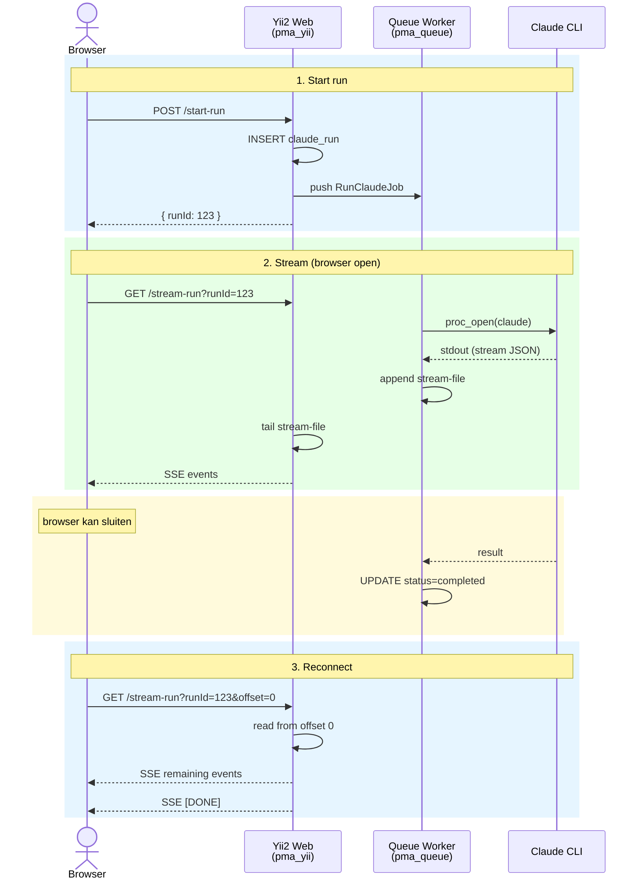

# Async Claude Inference — Technisch Plan

## Beslissingen

| Onderwerp | Beslissing |
|-----------|-----------|
| Direct mode | Vervangen door async flow (tijdelijk wrapper, daarna verwijderen) |
| Queue library | `yii2-queue` met DB driver (poll interval 3s — acceptabel, UX via animatie) |
| Docker worker | Apart service `pma_queue` in `docker-compose.yml` |
| Target platform | Mac Mini M4 64 GB, Docker Desktop met VirtioFS |
| `result_text` formaat | Markdown (Claude CLI output), niet Quill Delta JSON — alleen voor background processing |

---

## Architectuuroverzicht



**Gedeelde resources** (Docker volumes):
- `storage/claude-runs/` — stream-files (worker schrijft, webserver leest)
- MySQL database — `claude_run` tabel, `queue` tabel

---

## Stap 1: Database — `claude_run` tabel

### Migration

**File**: `yii/migrations/m260211_000001_create_claude_run_table.php`

Gebruikt `safeUp()`/`safeDown()` conform workflow.md, `{{%table_name}}` syntax voor prefix-support.

```sql
CREATE TABLE {{%claude_run}} (
    id              INT UNSIGNED AUTO_INCREMENT PRIMARY KEY,
    user_id         INT NOT NULL,
    project_id      INT NOT NULL,
    session_id      VARCHAR(191) NULL,
    status          ENUM('pending','running','completed','failed','cancelled') NOT NULL DEFAULT 'pending',
    prompt_markdown LONGTEXT NOT NULL,
    prompt_summary  VARCHAR(255) NULL,
    options         JSON NULL,
    working_directory VARCHAR(500) NULL,
    stream_log      LONGTEXT NULL,
    result_text     LONGTEXT NULL,
    result_metadata JSON NULL,
    error_message   TEXT NULL,
    pid             INT UNSIGNED NULL,
    started_at      DATETIME NULL,
    completed_at    DATETIME NULL,
    created_at      DATETIME NOT NULL,
    updated_at      DATETIME NOT NULL,

    INDEX idx_claude_run_user_status (user_id, status),
    INDEX idx_claude_run_project (project_id),
    INDEX idx_claude_run_session (session_id),

    CONSTRAINT fk_claude_run_user FOREIGN KEY (user_id) REFERENCES {{%user}}(id),
    CONSTRAINT fk_claude_run_project FOREIGN KEY (project_id) REFERENCES {{%project}}(id)
) ENGINE=InnoDB DEFAULT CHARSET=utf8mb4;
```

Run op beide schemas:
```bash
docker exec pma_yii yii migrate --migrationNamespaces=app\\migrations --interactive=0
docker exec pma_yii yii_test migrate --migrationNamespaces=app\\migrations --interactive=0
```

### Indices-rationale
- `(user_id, status)`: Primaire query — "mijn lopende/recente runs"
- `(project_id)`: Filter op project-pagina
- `(session_id)`: Opzoeken van runs binnen dezelfde conversatie

---

## Stap 2: Model — `ClaudeRun`

**File**: `yii/models/ClaudeRun.php`

### Enum: `ClaudeRunStatus`

**File**: `yii/common/enums/ClaudeRunStatus.php`

Volgt het bestaande enum-patroon (`ClaudePermissionMode`, `CopyType`, `SearchMode`):

```php
namespace common\enums;

enum ClaudeRunStatus: string
{
    case PENDING = 'pending';
    case RUNNING = 'running';
    case COMPLETED = 'completed';
    case FAILED = 'failed';
    case CANCELLED = 'cancelled';

    public static function values(): array
    {
        return array_map(static fn(self $status): string => $status->value, self::cases());
    }

    public static function labels(): array
    {
        $labels = [];
        foreach (self::cases() as $status) {
            $labels[$status->value] = $status->label();
        }

        return $labels;
    }

    public function label(): string
    {
        return match ($this) {
            self::PENDING => 'Pending',
            self::RUNNING => 'Running',
            self::COMPLETED => 'Completed',
            self::FAILED => 'Failed',
            self::CANCELLED => 'Cancelled',
        };
    }

    /**
     * @return string[]
     */
    public static function activeValues(): array
    {
        return [self::PENDING->value, self::RUNNING->value];
    }

    /**
     * @return string[]
     */
    public static function terminalValues(): array
    {
        return [self::COMPLETED->value, self::FAILED->value, self::CANCELLED->value];
    }
}
```

### Model

```php
namespace app\models;

use app\common\enums\ClaudeRunStatus;
use app\models\query\ClaudeRunQuery;
use app\models\traits\TimestampTrait;
use app\modules\identity\models\User;
use Yii;
use yii\db\ActiveQuery;
use yii\db\ActiveRecord;

/**
 * @property int $id
 * @property int $user_id
 * @property int $project_id
 * @property string|null $session_id
 * @property string $status
 * @property string $prompt_markdown
 * @property string|null $prompt_summary
 * @property string|null $options
 * @property string|null $working_directory
 * @property string|null $stream_log
 * @property string|null $result_text
 * @property string|null $result_metadata
 * @property string|null $error_message
 * @property int|null $pid
 * @property string|null $started_at
 * @property string|null $completed_at
 * @property string $created_at
 * @property string $updated_at
 *
 * @property-read User $user
 * @property-read Project $project
 */
class ClaudeRun extends ActiveRecord
{
    use TimestampTrait;

    public const MAX_CONCURRENT_RUNS = 3;

    public static function tableName(): string
    {
        return '{{%claude_run}}';
    }

    public function rules(): array
    {
        return [
            [['user_id', 'project_id', 'prompt_markdown'], 'required'],
            [['user_id', 'project_id', 'pid'], 'integer'],
            ['status', 'in', 'range' => ClaudeRunStatus::values()],
            ['status', 'default', 'value' => ClaudeRunStatus::PENDING->value],
            ['session_id', 'string', 'max' => 191],
            ['prompt_summary', 'string', 'max' => 255],
            ['working_directory', 'string', 'max' => 500],
            [['prompt_markdown', 'stream_log', 'result_text', 'error_message'], 'string'],
            [['options', 'result_metadata'], 'safe'],
        ];
    }

    public function attributeLabels(): array
    {
        return [
            'id' => 'ID',
            'user_id' => 'User',
            'project_id' => 'Project',
            'session_id' => 'Session',
            'status' => 'Status',
            'prompt_markdown' => 'Prompt',
            'prompt_summary' => 'Summary',
            'started_at' => 'Started',
            'completed_at' => 'Completed',
            'created_at' => 'Created',
            'updated_at' => 'Updated',
        ];
    }

    public static function find(): ClaudeRunQuery
    {
        return new ClaudeRunQuery(static::class);
    }

    public function init(): void
    {
        parent::init();

        if ($this->isNewRecord && $this->user_id === null && PHP_SAPI !== 'cli') {
            $this->user_id = Yii::$app->user->id;
        }
    }

    public function beforeSave($insert): bool
    {
        if (!parent::beforeSave($insert)) {
            return false;
        }

        $this->handleTimestamps($insert);

        return true;
    }

    // --- Relations ---

    public function getUser(): ActiveQuery
    {
        return $this->hasOne(User::class, ['id' => 'user_id']);
    }

    public function getProject(): ActiveQuery
    {
        return $this->hasOne(Project::class, ['id' => 'project_id']);
    }

    // --- State helpers ---

    public function isActive(): bool
    {
        return in_array($this->status, ClaudeRunStatus::activeValues(), true);
    }

    public function isTerminal(): bool
    {
        return in_array($this->status, ClaudeRunStatus::terminalValues(), true);
    }

    public function getStreamFilePath(): string
    {
        return Yii::getAlias('@app/storage/claude-runs/') . $this->id . '.ndjson';
    }

    // --- Status transitions ---

    public function markRunning(int $pid): void
    {
        $this->updateAttributes([
            'status' => ClaudeRunStatus::RUNNING->value,
            'pid' => $pid,
            'started_at' => date('Y-m-d H:i:s'),
            'updated_at' => date('Y-m-d H:i:s'),
        ]);
    }

    public function markCompleted(string $resultText, array $metadata): void
    {
        $this->updateAttributes([
            'status' => ClaudeRunStatus::COMPLETED->value,
            'result_text' => $resultText,
            'result_metadata' => json_encode($metadata),
            'completed_at' => date('Y-m-d H:i:s'),
            'pid' => null,
            'updated_at' => date('Y-m-d H:i:s'),
        ]);
    }

    public function markFailed(string $error): void
    {
        $this->updateAttributes([
            'status' => ClaudeRunStatus::FAILED->value,
            'error_message' => $error,
            'completed_at' => date('Y-m-d H:i:s'),
            'pid' => null,
            'updated_at' => date('Y-m-d H:i:s'),
        ]);
    }

    public function markCancelled(): void
    {
        $this->updateAttributes([
            'status' => ClaudeRunStatus::CANCELLED->value,
            'completed_at' => date('Y-m-d H:i:s'),
            'pid' => null,
            'updated_at' => date('Y-m-d H:i:s'),
        ]);
    }

    public function touchHeartbeat(): void
    {
        $this->updateAttributes(['updated_at' => date('Y-m-d H:i:s')]);
    }
}
```

### Query class: `ClaudeRunQuery`

**File**: `yii/models/query/ClaudeRunQuery.php`

```php
namespace app\models\query;

use app\common\enums\ClaudeRunStatus;
use app\models\ClaudeRun;
use yii\db\ActiveQuery;

/**
 * @extends ActiveQuery<ClaudeRun>
 */
class ClaudeRunQuery extends ActiveQuery
{
    public function forUser(int $userId): self
    {
        return $this->andWhere([ClaudeRun::tableName() . '.user_id' => $userId]);
    }

    public function forProject(int $projectId): self
    {
        return $this->andWhere([ClaudeRun::tableName() . '.project_id' => $projectId]);
    }

    public function withStatus(string|array $status): self
    {
        return $this->andWhere([ClaudeRun::tableName() . '.status' => $status]);
    }

    public function active(): self
    {
        return $this->withStatus(ClaudeRunStatus::activeValues());
    }

    public function orderedByCreated(): self
    {
        return $this->orderBy([ClaudeRun::tableName() . '.created_at' => SORT_DESC]);
    }
}
```

---

## Stap 3: Queue Infrastructure

### Composer dependency

```bash
docker exec pma_yii composer require yiisoft/yii2-queue:~2.3
```

### Config

**File**: `yii/config/main.php` (toevoegen aan `components`):

```php
'queue' => [
    'class' => \yii\queue\db\Queue::class,
    'db' => 'db',
    'tableName' => '{{%queue}}',
    'channel' => 'claude',
    'mutex' => \yii\mutex\MysqlMutex::class,
    'ttr' => 3900,          // time-to-reserve: 65 minuten (> max Claude timeout van 3600s)
    'attempts' => 1,         // geen auto-retry (inference is niet idempotent)
],
```

**Poll interval**: De DB driver pollt standaard elke 3 seconden. Dit geeft maximaal 3s latentie bij run start — acceptabel voor single-user deployment. De browser toont een "Starting inference..." animatie die deze latentie maskeert. Later te upgraden naar Redis driver voor sub-seconde latentie.

### Queue tabel migration

`yii2-queue` brengt eigen migrations mee:
```bash
docker exec pma_yii yii migrate --migrationPath=@yii/queue/drivers/db/migrations --interactive=0
docker exec pma_yii yii_test migrate --migrationPath=@yii/queue/drivers/db/migrations --interactive=0
```

### Docker service — `pma_queue`

**File**: `docker-compose.yml` (toevoegen):

```yaml
pma_queue:
  restart: unless-stopped
  build:
    context: .
    dockerfile: ./docker/yii/Dockerfile
    args:
      - USER_ID=${USER_ID:-1000}
      - USER_NAME=${USER_NAME:-appuser}
      - PHP_FPM_PORT=${PHP_FPM_PORT:-9000}
  container_name: pma_queue
  working_dir: /var/www/html/yii
  mem_limit: 256m
  environment:
    HOME: /home/${USER_NAME}
    PATH: /home/${USER_NAME}/.local/bin:/var/www/html/yii:/usr/local/sbin:/usr/local/bin:/usr/sbin:/usr/bin:/sbin:/bin
    TZ: ${TIMEZONE:-Europe/Amsterdam}
  extra_hosts:
    - 'host.docker.internal:host-gateway'
  env_file:
    - .env
    - path: .env.db
      required: false
  command: ["php", "yii", "queue/listen", "--verbose=1"]
  volumes:
    - .:/var/www/html
    - ${PROJECTS_ROOT}:/projects:rw
    - ${HOME}/.claude:/home/${USER_NAME}/.claude
    - ${HOME}/.claude.json:/home/${USER_NAME}/.claude.json
    - ${HOME}/.local/bin:/home/${USER_NAME}/.local/bin
    - ${HOME}/.local/share:/home/${USER_NAME}/.local/share
  depends_on:
    - pma_mysql
  networks:
    - promptmanager_network
```

**Toelichting volumes**:
- `.:/var/www/html` — zelfde codebase als `pma_yii`
- `${PROJECTS_ROOT}:/projects:rw` — toegang tot projectbestanden (Claude CLI werkt hierin)
- `~/.claude*` — Claude CLI credentials en config
- `~/.local/bin` + `~/.local/share` — `claude` binary (geïnstalleerd via npm global)
- Geen nginx/php-fpm volumes — niet nodig voor CLI worker
- Geen xdebug/IDE volumes — niet nodig voor worker

**Geheugenbeslag**:
- `mem_limit: 256m` — hard cap, voorkomt OOM-impact op host
- Idle: ~30-50 MB (PHP CLI + Yii2 + queue listen loop)
- Actief: ~80 MB (+ proc_open child process voor Claude CLI)
- Op Mac Mini 64 GB: <0.5% van totaal geheugen

### Deployment / Worker herstart bij code-updates

`queue/listen` draait persistent — bij code-updates (git pull, deploy) moet de worker herstarten om nieuwe code te laden. Strategie:

```bash
# Na code-update: herstart de worker container
docker restart pma_queue
```

**Automatiseren**: Voeg toe aan bestaand deploy-script of git post-merge hook:
```bash
#!/bin/bash
# post-deploy.sh (of git hook)
docker restart pma_queue
echo "Queue worker restarted."
```

**Docker Compose**: `restart: unless-stopped` zorgt dat de worker automatisch herstart na Docker Desktop reboot of na `docker restart`. Bij OOM-kill herstart Docker de container ook automatisch.

---

## Stap 4: Job — `RunClaudeJob`

**File**: `yii/jobs/RunClaudeJob.php`

```php
namespace app\jobs;

use app\common\enums\ClaudeRunStatus;
use app\models\ClaudeRun;
use app\services\ClaudeCliService;
use RuntimeException;
use Throwable;
use Yii;
use yii\base\BaseObject;
use yii\queue\RetryableJobInterface;

/**
 * Background job that executes a Claude CLI inference run.
 *
 * Serialized property: $runId (the only data persisted by the queue).
 *
 * @throws RuntimeException when run is cancelled by user
 */
class RunClaudeJob extends BaseObject implements RetryableJobInterface
{
    public int $runId;

    public function execute($queue): void
    {
        $run = ClaudeRun::findOne($this->runId);
        if ($run === null || $run->status !== ClaudeRunStatus::PENDING->value) {
            return; // run verwijderd of al opgepakt
        }

        $streamFile = $run->getStreamFilePath();
        $this->ensureStreamDirectory();

        // Atomaire status-transitie: voorkom dubbel oppakken
        $affected = ClaudeRun::updateAll(
            [
                'status' => ClaudeRunStatus::RUNNING->value,
                'pid' => getmypid(),
                'started_at' => date('Y-m-d H:i:s'),
                'updated_at' => date('Y-m-d H:i:s'),
            ],
            ['id' => $run->id, 'status' => ClaudeRunStatus::PENDING->value]
        );
        if ($affected === 0) {
            return; // iemand anders was sneller
        }
        $run->refresh();

        $lastHeartbeat = 0;
        $lastCancelCheck = 0;

        $shouldCancel = function () use ($run, &$lastCancelCheck): bool {
            if (time() - $lastCancelCheck < 10) {
                return false;
            }
            $lastCancelCheck = time();
            $run->refresh();
            return $run->status === ClaudeRunStatus::CANCELLED->value;
        };

        $onLine = function (string $line) use ($run, $streamFile, &$lastHeartbeat, $shouldCancel) {
            // 1. Schrijf naar stream-file (voor live relay)
            file_put_contents($streamFile, $line . "\n", FILE_APPEND | LOCK_EX);

            // 2. Capture session_id uit init event
            if ($run->session_id === null) {
                $decoded = json_decode($line, true);
                if (($decoded['type'] ?? null) === 'system' && isset($decoded['session_id'])) {
                    $run->updateAttributes(['session_id' => $decoded['session_id']]);
                }
            }

            // 3. Heartbeat elke 30 seconden
            if (time() - $lastHeartbeat > 30) {
                $run->touchHeartbeat();
                $lastHeartbeat = time();
            }

            // 4. Check voor cancellation (elke 10s, via shouldCancel)
            if ($shouldCancel()) {
                throw new RuntimeException('Run cancelled by user');
            }
        };

        /** @var ClaudeCliService $claudeCliService */
        $claudeCliService = Yii::createObject(ClaudeCliService::class);

        try {
            $result = $claudeCliService->executeStreaming(
                $run->prompt_markdown,
                $run->working_directory,
                $onLine,
                3600,
                json_decode($run->options, true) ?? [],
                $run->project,
                $run->session_id
            );

            // Parse stream-file voor eindresultaat
            $streamContent = is_file($streamFile) ? file_get_contents($streamFile) : '';
            $parsed = $this->parseStreamResult($streamContent);

            if ($result['exitCode'] === 0) {
                $run->markCompleted($parsed['resultText'] ?? '', $parsed['metadata'] ?? []);
            } else {
                $run->markFailed($result['error'] ?: 'Exit code: ' . $result['exitCode']);
            }

            // Bewaar volledige stream log in DB (voor replay na file-cleanup)
            // Noot: bij zeer lange runs (>10MB) veroorzaakt dit een memory-piek.
            // Acceptabel voor single-user; stream_log is fallback-only.
            $run->updateAttributes(['stream_log' => $streamContent]);

        } catch (RuntimeException $e) {
            // Cancel-exception: run status is al 'cancelled' (gezet door controller)
            if ($e->getMessage() === 'Run cancelled by user') {
                // Sla partial output op
                if (is_file($streamFile)) {
                    $run->updateAttributes(['stream_log' => file_get_contents($streamFile)]);
                }
                Yii::info("Run #{$run->id} cancelled by user", __METHOD__);
            } else {
                $run->markFailed($e->getMessage());
                Yii::error('RunClaudeJob failed: ' . $e->getMessage(), __METHOD__);
            }
        } catch (Throwable $e) {
            $run->markFailed($e->getMessage());
            Yii::error('RunClaudeJob failed: ' . $e->getMessage(), __METHOD__);
        }
    }

    public function getTtr(): int
    {
        return 3900; // 65 minuten
    }

    public function canRetry($attempt, $error): bool
    {
        return false; // geen retry — inference is niet idempotent
    }

    private function ensureStreamDirectory(): void
    {
        $dir = Yii::getAlias('@app/storage/claude-runs');
        if (!is_dir($dir)) {
            mkdir($dir, 0775, true);
        }
    }

    /**
     * Extracts result text and metadata from NDJSON stream content.
     */
    private function parseStreamResult(string $ndjson): array
    {
        $lines = explode("\n", trim($ndjson));
        $resultText = '';
        $metadata = [];

        foreach ($lines as $line) {
            $decoded = json_decode(trim($line), true);
            if (!is_array($decoded))
                continue;

            if (($decoded['type'] ?? null) === 'result') {
                $resultText = $decoded['result'] ?? '';
                $metadata = [
                    'duration_ms' => $decoded['duration_ms'] ?? null,
                    'session_id' => $decoded['session_id'] ?? null,
                    'num_turns' => $decoded['num_turns'] ?? null,
                    'modelUsage' => $decoded['modelUsage'] ?? null,
                ];
            }
        }

        return ['resultText' => $resultText, 'metadata' => $metadata];
    }
}
```

### Verantwoording: ClaudeCliService instantiëring in job

`ClaudeCliService` is **niet** geregistreerd als Yii2 component of container definitie — het wordt puur via DI auto-wiring opgelost (constructor type hints). De bestaande codebase heeft geen enkele `Yii::$app->get()` call in services (geverifieerd via grep). Daarom gebruiken we `Yii::createObject(ClaudeCliService::class)` die het DI-container respecteert.

### Heartbeat vs. cancel-poll bij langdurige output-stilte

De `$onLine` callback wordt alleen aangeroepen als Claude CLI stdout output schrijft. Als Claude een langdurig blok genereert zonder newlines, worden heartbeat en cancel-poll niet uitgevoerd. In de praktijk schrijft Claude CLI streaming output in kleine chunks (per token), waardoor dit geen reëel probleem is — de Claude CLI `--output-format stream-json` flag forceert per-event output. Het alternatief (non-blocking I/O met `stream_select()` en periodic polling) voegt significante complexiteit toe aan `ClaudeCliService` voor een scenario dat in de praktijk niet voorkomt. Als dit toch een probleem blijkt, kan het in een latere iteratie opgelost worden door een `$shouldCancel` callable parameter toe te voegen aan `executeStreaming()`.

### Aanpassing aan ClaudeCliService::executeStreaming()

**File**: `yii/services/ClaudeCliService.php`

De `connection_aborted()` check moet conditioneel worden — in CLI context (queue worker) is er geen browser:

```php
// Bestaande code (regel ~268):
if (connection_aborted()) {

// Wordt:
if (PHP_SAPI !== 'cli' && connection_aborted()) {
```

De `$streamToken` parameter wordt `null` wanneer aangeroepen vanuit de job (geen browser session). De `storeProcessPid()` en `clearProcessPid()` methoden gebruiken `Yii::$app->user->id` + `$streamToken` als cache key. In CLI context is `Yii::$app->user` niet beschikbaar. De PID-opslag is irrelevant voor de job: cancellation gaat via de DB status-poll, niet via PID cache.

**Belangrijk**: De bestaande code (regel ~216-218) genereert een fallback `streamToken` + waarschuwingslog als `$streamToken === null`. Dit moet aangepast worden zodat `null` een legitieme waarde is (= geen PID-caching nodig). Zonder deze fix logt elke job-executie een onterechte warning.

```php
// Bestaande code (regel ~216-218):
if ($streamToken === null) {
    $streamToken = bin2hex(random_bytes(16));
    Yii::warning('streamToken was null, generated fallback: ' . $streamToken, __METHOD__);
}

// Wordt: verwijder de fallback — null is valide vanuit de job context.
// De PID store/clear calls worden conditioneel (zie onder).
```

```php
// In executeStreaming(), na proc_get_status:
if ($streamToken !== null) {
    $this->storeProcessPid($status['pid'], $streamToken);
}

// ... en bij cleanup (timeout, abort, einde):
if ($streamToken !== null) {
    $this->clearProcessPid($streamToken);
}
```

Dit zijn **vier wijzigingen** aan de bestaande service: (1) `connection_aborted()` CLI guard, (2) verwijder null-fallback voor streamToken, (3) conditionele `storeProcessPid`, (4) conditionele `clearProcessPid`.

---

## Stap 5: Stream Relay Service

**File**: `yii/services/ClaudeStreamRelayService.php`

```php
namespace app\services;

/**
 * Relays NDJSON stream events from a file to a callback.
 * Used by the SSE endpoint to forward worker output to connected browsers.
 */
class ClaudeStreamRelayService
{
    /**
     * Relay stream events vanuit een NDJSON file naar een callback.
     * Blijft wachten op nieuwe data zolang $isRunning() true retourneert.
     *
     * Offset is byte-based (fseek). Reconnect met offset=0 replays vanaf begin.
     *
     * @param string $streamFilePath Pad naar het NDJSON stream-file
     * @param int $offset Byte-offset om vanaf te lezen (0 = begin)
     * @param callable(string): void $onLine Callback per regel
     * @param callable(): bool $isRunning Callback die checkt of de run nog actief is
     * @param int $maxWaitSeconds Max wachttijd als er geen nieuwe data komt
     * @return int Nieuwe byte-offset na lezen
     */
    public function relay(
        string $streamFilePath,
        int $offset,
        callable $onLine,
        callable $isRunning,
        int $maxWaitSeconds = 300
    ): int {
        if (!is_file($streamFilePath)) {
            return $offset;
        }

        $handle = fopen($streamFilePath, 'r');
        if ($handle === false) {
            return $offset;
        }

        fseek($handle, $offset);
        $idleStart = null;

        while (true) {
            $line = fgets($handle);

            if ($line !== false) {
                $idleStart = null;
                $trimmed = trim($line);
                if ($trimmed !== '') {
                    $onLine($trimmed);
                }
                continue;
            }

            // Geen nieuwe data — check of we moeten stoppen
            if (!$isRunning()) {
                // Lees eventuele laatste regels (geschreven tussen check en fgets)
                while (($tail = fgets($handle)) !== false) {
                    $trimmed = trim($tail);
                    if ($trimmed !== '') {
                        $onLine($trimmed);
                    }
                }
                break;
            }

            // Check client disconnect (browser weg)
            if (PHP_SAPI !== 'cli' && connection_aborted()) {
                break;
            }

            // Idle timeout
            if ($idleStart === null) {
                $idleStart = time();
            } elseif (time() - $idleStart > $maxWaitSeconds) {
                break;
            }

            // Wacht 100ms voor volgende poll
            usleep(100000);
            clearstatcache(true, $streamFilePath);
        }

        $finalOffset = ftell($handle);
        fclose($handle);

        return $finalOffset;
    }
}
```

---

## Stap 6: Controller Aanpassingen

**File**: `yii/controllers/ClaudeController.php`

### Nieuwe dependencies

```php
use app\common\enums\ClaudeRunStatus;
use app\jobs\RunClaudeJob;
use app\models\ClaudeRun;
use app\services\ClaudeStreamRelayService;

private readonly ClaudeStreamRelayService $relayService;

// In constructor (toevoegen aan bestaande parameters):
ClaudeStreamRelayService $relayService,
```

### Shared helper: `createRun()`

Gedeelde logica voor zowel `actionStartRun` als de `actionStream` migratiewrapper. Dit voorkomt het probleem van een JSON-action aanroepen vanuit een SSE-action:

```php
/**
 * Maakt een ClaudeRun record aan en pusht een job naar de queue.
 *
 * @return array{success: true, runId: int, promptMarkdown: string}|array{success: false, error: string}
 */
private function createRun(Project $project): array
{
    $prepared = $this->prepareClaudeRequest($project);

    if (isset($prepared['error'])) {
        return ['success' => false, 'error' => $prepared['error']['error'] ?? 'Request preparation failed.'];
    }

    // Concurrency check
    $activeCount = ClaudeRun::find()
        ->forUser(Yii::$app->user->id)
        ->active()
        ->count();

    if ($activeCount >= ClaudeRun::MAX_CONCURRENT_RUNS) {
        return [
            'success' => false,
            'error' => 'Maximum concurrent runs reached (' . ClaudeRun::MAX_CONCURRENT_RUNS . ').',
            'httpStatus' => 429,
        ];
    }

    $run = new ClaudeRun([
        'user_id' => Yii::$app->user->id,
        'project_id' => $project->id,
        'session_id' => $prepared['sessionId'],
        'prompt_markdown' => $prepared['markdown'],
        'prompt_summary' => mb_substr($prepared['markdown'], 0, 255),
        'options' => json_encode($prepared['options']),
        'working_directory' => $prepared['workingDirectory'],
    ]);

    if (!$run->save()) {
        return ['success' => false, 'error' => 'Failed to create run.'];
    }

    Yii::$app->queue->push(new RunClaudeJob(['runId' => $run->id]));

    return [
        'success' => true,
        'runId' => $run->id,
        'promptMarkdown' => $prepared['markdown'],
    ];
}
```

### actionStartRun (POST)

```php
public function actionStartRun(int $p): array
{
    Yii::$app->response->format = Response::FORMAT_JSON;

    $project = $this->findProject($p);
    $result = $this->createRun($project);

    if (!($result['success'] ?? false) && isset($result['httpStatus'])) {
        Yii::$app->response->statusCode = $result['httpStatus'];
        unset($result['httpStatus']);
    }

    return $result;
}
```

### actionStreamRun (GET)

```php
public function actionStreamRun(int $runId, int $offset = 0): void
{
    $run = ClaudeRun::find()
        ->forUser(Yii::$app->user->id)
        ->andWhere(['id' => $runId])
        ->one();

    if ($run === null) {
        throw new NotFoundHttpException();
    }

    Yii::$app->session->close();
    ignore_user_abort(false);
    $this->beginSseResponse();

    // Stuur prompt markdown als eerste event (zodat frontend de user message kan tonen)
    echo "data: " . json_encode([
        'type' => 'prompt_markdown',
        'markdown' => $run->prompt_markdown,
    ]) . "\n\n";
    flush();

    $streamFile = $run->getStreamFilePath();

    // Wacht max 10s tot stream-file verschijnt (worker nog niet gestart)
    $waitStart = time();
    while (!is_file($streamFile) && $run->isActive()) {
        if (time() - $waitStart > 10) break;
        echo "data: " . json_encode(['type' => 'waiting']) . "\n\n";
        flush();
        usleep(500000);
        $run->refresh();
    }

    if (is_file($streamFile)) {
        $this->relayService->relay(
            $streamFile,
            $offset,
            function (string $line) {
                echo "data: " . $line . "\n\n";
                flush();
            },
            function () use ($run) {
                $run->refresh();
                return $run->isActive();
            }
        );
    }

    // Fallback: als run klaar is maar stream-file niet (meer) bestaat
    $run->refresh();
    if ($run->isTerminal() && !is_file($streamFile) && $run->stream_log !== null) {
        // Replay vanuit DB
        $lines = explode("\n", $run->stream_log);
        foreach ($lines as $line) {
            $trimmed = trim($line);
            if ($trimmed !== '') {
                echo "data: " . $trimmed . "\n\n";
                flush();
            }
        }
    }

    echo "data: [DONE]\n\n";
    flush();
}
```

**Session lock**: `Yii::$app->session->close()` wordt aangeroepen om het session file-lock vrij te geven. Zonder dit blokkeert de SSE long-poll alle andere requests van dezelfde user (sessie is exclusief per default in PHP). De bestaande `actionStream` doet dit al. Andere requests (bijv. `actionActiveRuns`) hebben hierdoor geen lock-conflict — zij openen en sluiten de sessie normaal in hun korte request-cycle.

### actionCancelRun (POST)

```php
public function actionCancelRun(int $runId): array
{
    Yii::$app->response->format = Response::FORMAT_JSON;

    $run = ClaudeRun::find()
        ->forUser(Yii::$app->user->id)
        ->andWhere(['id' => $runId])
        ->one();

    if ($run === null) {
        throw new NotFoundHttpException();
    }

    if (!$run->isActive()) {
        return ['success' => true, 'cancelled' => false, 'reason' => 'Run is not active.'];
    }

    // Primaire cancel-methode: zet status naar cancelled.
    // De job pollt de status elke 10 seconden en stopt als het 'cancelled' is.
    // posix_kill werkt NIET cross-container (aparte PID-namespaces).
    $run->markCancelled();

    return ['success' => true, 'cancelled' => true];
}
```

### actionActiveRuns (GET)

```php
public function actionActiveRuns(int $p): array
{
    Yii::$app->response->format = Response::FORMAT_JSON;

    $this->findProject($p);

    $runs = ClaudeRun::find()
        ->forUser(Yii::$app->user->id)
        ->forProject($p)
        ->active()
        ->orderedByCreated()
        ->all();

    return [
        'success' => true,
        'runs' => array_map(fn(ClaudeRun $r) => [
            'id' => $r->id,
            'status' => $r->status,
            'promptSummary' => $r->prompt_summary,
            'sessionId' => $r->session_id,
            'startedAt' => $r->started_at,
            'createdAt' => $r->created_at,
        ], $runs),
    ];
}
```

### actionRunStatus (GET)

```php
public function actionRunStatus(int $runId): array
{
    Yii::$app->response->format = Response::FORMAT_JSON;

    $run = ClaudeRun::find()
        ->forUser(Yii::$app->user->id)
        ->andWhere(['id' => $runId])
        ->one();

    if ($run === null) {
        throw new NotFoundHttpException();
    }

    return [
        'success' => true,
        'id' => $run->id,
        'status' => $run->status,
        'sessionId' => $run->session_id,
        'resultMetadata' => $run->result_metadata ? json_decode($run->result_metadata, true) : null,
        'errorMessage' => $run->error_message,
        'startedAt' => $run->started_at,
        'completedAt' => $run->completed_at,
    ];
}
```

### Migratiestrategie — bestaande actions

Fase 1 (deze implementatie):
- Nieuwe actions worden toegevoegd
- `actionStream` wordt intern een wrapper die `createRun()` + `actionStreamRun()` aanroept:

```php
public function actionStream(int $p): void
{
    $project = $this->findProject($p);
    $result = $this->createRun($project);

    if (!($result['success'] ?? false)) {
        $this->sendSseError($result['error'] ?? 'Failed to start run.');
        return;
    }

    // Delegate naar streamRun
    $this->actionStreamRun($result['runId']);
}
```

Fase 2 (na validatie, 1-2 weken):
- Verwijder `actionStream`, `actionRun`, `actionCancel`
- Update frontend om rechtstreeks `startRun` + `streamRun` te gebruiken

### VerbFilter + AccessControl update

```php
'verbs' => [
    'actions' => [
        // ... bestaande ...
        'start-run' => ['POST'],
        'stream-run' => ['GET'],
        'cancel-run' => ['POST'],
        'run-status' => ['GET'],
        'active-runs' => ['GET'],
    ],
],
'access' => [
    'rules' => [
        // Bestaande rules blijven ongewijzigd (index, stream, run, cancel, etc.)

        // Project-gebaseerde actions: ownership via findProject() + matchCallback
        [
            'actions' => ['start-run', 'active-runs'],
            'allow' => true,
            'roles' => ['@'],
            'matchCallback' => function () {
                $projectId = (int) Yii::$app->request->get('p');
                $model = $this->findProject($projectId);
                return $this->permissionService->checkPermission('viewProject', $model);
            },
        ],

        // Run-gebaseerde actions: ownership check via ClaudeRun.user_id in de action zelf
        // Geen matchCallback nodig — forUser() query garandeert eigenaarschap
        [
            'actions' => ['stream-run', 'cancel-run', 'run-status'],
            'allow' => true,
            'roles' => ['@'],
        ],
    ],
],
```

---

## Stap 7: RBAC

**File**: `yii/rbac/ClaudeRunOwnerRule.php`

Volgt hetzelfde patroon als `ScratchPadOwnerRule`:

```php
namespace app\rbac;

use app\models\ClaudeRun;
use yii\rbac\Rule;

class ClaudeRunOwnerRule extends Rule
{
    public $name = 'isClaudeRunOwner';

    public function execute($user, $item, $params): bool
    {
        $model = $params['model'] ?? null;
        return $model instanceof ClaudeRun && $model->user_id === (int) $user;
    }
}
```

**Noot**: Alle run-gebaseerde actions controleren eigenaarschap via `ClaudeRun::find()->forUser()` in de query zelf. De RBAC rule is optioneel maar aanbevolen voor consistentie met het bestaande patroon. Registreer in `RbacController` naast bestaande rules.

---

## Stap 8: Console Commands

**File**: `yii/commands/ClaudeRunController.php`

Naast bestaande `yii/commands/ClaudeController.php` (workspace sync + diagnose) — aparte controller voor run-specifieke commands:

```php
namespace app\commands;

use app\common\enums\ClaudeRunStatus;
use app\models\ClaudeRun;
use Yii;
use yii\console\Controller;
use yii\console\ExitCode;
use yii\helpers\Console;

/**
 * Manages Claude inference run lifecycle.
 *
 * Usage:
 *   ./yii claude-run/cleanup-stale    Mark stale runs as failed
 *   ./yii claude-run/cleanup-files    Remove old stream files
 */
class ClaudeRunController extends Controller
{
    /**
     * Markeer stale runs als failed.
     * Draai via cron: *​/5 * * * * docker exec pma_queue php yii claude-run/cleanup-stale
     */
    public function actionCleanupStale(int $thresholdMinutes = 5): int
    {
        $threshold = date('Y-m-d H:i:s', time() - ($thresholdMinutes * 60));

        $staleRuns = ClaudeRun::find()
            ->withStatus(ClaudeRunStatus::RUNNING->value)
            ->andWhere(['<', 'updated_at', $threshold])
            ->all();

        foreach ($staleRuns as $run) {
            $run->markFailed('Worker process lost (no heartbeat for ' . $thresholdMinutes . ' minutes).');
            Yii::warning("Marked stale run #{$run->id} as failed", __METHOD__);
        }

        if (count($staleRuns) > 0) {
            $this->stdout("Cleaned up " . count($staleRuns) . " stale runs.\n", Console::FG_YELLOW);
        } else {
            $this->stdout("No stale runs found.\n");
        }

        return ExitCode::OK;
    }

    /**
     * Verwijder oude stream-files.
     * Draai via cron: 0 3 * * * docker exec pma_queue php yii claude-run/cleanup-files
     */
    public function actionCleanupFiles(int $maxAgeHours = 24): int
    {
        $dir = Yii::getAlias('@app/storage/claude-runs');
        if (!is_dir($dir)) {
            $this->stdout("Stream directory does not exist.\n");
            return ExitCode::OK;
        }

        $threshold = time() - ($maxAgeHours * 3600);
        $count = 0;

        foreach (glob($dir . '/*.ndjson') as $file) {
            if (filemtime($file) < $threshold) {
                unlink($file);
                $count++;
            }
        }

        $this->stdout("Removed {$count} stream files older than {$maxAgeHours} hours.\n");
        return ExitCode::OK;
    }
}
```

### Cron setup

Voeg toe aan de crontab van de host of als Docker healthcheck:

```bash
# Crontab (host machine) — draai in pma_yii, niet pma_queue.
# Rationale: als pma_queue crasht kan het zijn eigen stale runs niet opruimen.
# pma_yii is altijd beschikbaar (webserver), dus cleanup blijft werken.
*/5 * * * * docker exec pma_yii php yii claude-run/cleanup-stale 2>&1 | logger -t pma_stale
0 3 * * * docker exec pma_yii php yii claude-run/cleanup-files 2>&1 | logger -t pma_cleanup
```

---

## Stap 9: Frontend Wijzigingen

**File**: `yii/views/claude/index.php`

### Nieuwe URL's genereren

```php
// PHP-zijde: URL's genereren met Url::to() zodat ? al in de URL zit
$startRunUrl = Url::to(array_merge(['/claude/start-run'], $pParam));
$streamRunUrl = Url::to(array_merge(['/claude/stream-run'], $pParam));
$cancelRunUrl = Url::to(array_merge(['/claude/cancel-run'], $pParam));
$activeRunsUrl = Url::to(array_merge(['/claude/active-runs'], $pParam));
$runStatusUrl = Url::to(array_merge(['/claude/run-status'], $pParam));
```

### ClaudeChat.send() — twee-staps flow

```javascript
send: function() {
    var self = this;
    var options = this.buildOptions();

    // Toon animatie direct (maskeert queue poll interval van ~3s)
    self.showStreamingPlaceholder();

    // Stap 1: Start run
    fetch(startRunUrl, {
        method: 'POST',
        headers: this.headers(),
        body: JSON.stringify(options)
    })
    .then(function(r) { return r.json(); })
    .then(function(data) {
        if (!data.success) {
            self.hideStreamingPlaceholder();
            self.onStreamError(data.error);
            return;
        }

        self.currentRunId = data.runId;

        // Stap 2: Hak aan op stream
        self.connectToStream(data.runId, 0);
    })
    .catch(function(err) {
        self.hideStreamingPlaceholder();
        self.onStreamError(err.message);
    });
}
```

### connectToStream — SSE relay met reconnect

```javascript
connectToStream: function(runId, offset) {
    var self = this;
    // Url::to() genereert URL met ?, dus & is correct hier
    var url = streamRunUrl + '&runId=' + runId + '&offset=' + offset;

    fetch(url, { headers: this.headers() })
    .then(function(response) {
        if (!response.ok) throw new Error('HTTP ' + response.status);
        var reader = response.body.getReader();
        var decoder = new TextDecoder();
        var buffer = '';

        function processStream() {
            return reader.read().then(function(result) {
                if (result.done) {
                    self.onStreamEnd();
                    return;
                }
                buffer += decoder.decode(result.value, { stream: true });
                var lines = buffer.split('\n');
                buffer = lines.pop();

                lines.forEach(function(line) {
                    if (line.startsWith('data: ')) {
                        var payload = line.substring(6);
                        if (payload === '[DONE]') {
                            self.onStreamEnd();
                            return;
                        }
                        try {
                            var event = JSON.parse(payload);
                            if (event.type === 'waiting') {
                                // Worker nog niet gestart — noop, animatie draait al
                                return;
                            }
                            self.onStreamEvent(event);
                        } catch (e) { /* skip unparseable lines */ }
                    }
                });

                return processStream();
            });
        }

        return processStream();
    })
    .catch(function(err) {
        self.onStreamError(err.message);
    });
}
```

### Cancel — werkt nu via runId

```javascript
cancelRun: function() {
    if (!this.currentRunId) return;

    fetch(cancelRunUrl, {
        method: 'POST',
        headers: this.headers(),
        body: JSON.stringify({ runId: this.currentRunId })
    });
}
```

### Reconnect bij pagina-load

```javascript
init: function() {
    // Bestaande init logica...

    // Check voor actieve runs bij dit project
    this.checkActiveRuns();
},

checkActiveRuns: function() {
    var self = this;
    fetch(activeRunsUrl, { headers: this.headers() })
    .then(function(r) { return r.json(); })
    .then(function(data) {
        if (!data.success || data.runs.length === 0) return;

        // Auto-connect naar meest recente running run
        var runningRun = data.runs.find(function(r) { return r.status === 'running'; });
        if (runningRun) {
            self.currentRunId = runningRun.id;
            self.sessionId = runningRun.sessionId;
            self.showStreamingPlaceholder();
            self.connectToStream(runningRun.id, 0);
        }

        // Toon badge als er actieve runs zijn
        if (data.runs.length > 0) {
            self.showActiveRunsBadge(data.runs.length);
        }
    });
}
```

---

## Stap 10: Tests

### Unit Tests

**File**: `yii/tests/unit/models/ClaudeRunTest.php`
- `testIsActiveReturnsTrueForPendingAndRunning`
- `testIsTerminalReturnsTrueForCompletedFailedCancelled`
- `testMarkRunningUpdatesStatusPidAndStartedAt`
- `testMarkCompletedUpdatesStatusResultAndCompletedAt`
- `testMarkFailedUpdatesStatusErrorAndCompletedAt`
- `testMarkCancelledUpdatesStatus`
- `testGetStreamFilePathReturnsExpectedPath`

**File**: `yii/tests/unit/models/query/ClaudeRunQueryTest.php`
- `testActiveFiltersOnPendingAndRunning`
- `testForUserFiltersOnUserId`
- `testForProjectFiltersOnProjectId`

**File**: `yii/tests/unit/jobs/RunClaudeJobTest.php`
- `testExecuteSkipsWhenRunNotPending`
- `testExecuteSkipsWhenRunNotFound`
- `testExecuteMarksRunAsRunning`
- `testExecuteWritesStreamFile`
- `testExecuteMarksCompletedOnSuccess`
- `testExecuteMarksFailedOnError`
- `testExecuteStopsWhenCancelled`
- `testCanRetryReturnsFalse`
- `testGetTtrReturns3900`

**File**: `yii/tests/unit/services/ClaudeStreamRelayServiceTest.php`
- `testRelayReadsFromOffset`
- `testRelayStopsWhenRunNotActive`
- `testRelayReturnsNewOffset`
- `testRelaySkipsEmptyLines`
- `testRelayHandlesMissingFile`

**File**: `yii/tests/unit/commands/ClaudeRunControllerTest.php`
- `testCleanupStaleMarksOldRunsAsFailed`
- `testCleanupStaleIgnoresRecentRuns`
- `testCleanupFilesRemovesOldFiles`
- `testCleanupFilesKeepsRecentFiles`

**File**: `yii/tests/unit/common/enums/ClaudeRunStatusTest.php`
- `testValuesReturnsAllStatusStrings`
- `testActiveValuesReturnsPendingAndRunning`
- `testTerminalValuesReturnsCompletedFailedCancelled`

---

## Implementatievolgorde

| # | Onderdeel | Afhankelijkheid | Bestanden |
|---|-----------|----------------|-----------|
| 1 | Migration `claude_run` tabel | — | `yii/migrations/m260211_000001_create_claude_run_table.php` |
| 2 | `ClaudeRunStatus` enum | — | `yii/common/enums/ClaudeRunStatus.php` |
| 3 | `ClaudeRun` model + query | 1, 2 | `yii/models/ClaudeRun.php`, `yii/models/query/ClaudeRunQuery.php` |
| 4 | `composer require yii2-queue` + config + queue migration | — | `composer.json`, `yii/config/main.php` |
| 5 | `ClaudeCliService` aanpassingen (3 regels) | — | `yii/services/ClaudeCliService.php` |
| 6 | `ClaudeStreamRelayService` | — | `yii/services/ClaudeStreamRelayService.php` |
| 7 | `RunClaudeJob` | 2, 3, 4, 5 | `yii/jobs/RunClaudeJob.php` |
| 8 | Controller actions | 3, 6, 7 | `yii/controllers/ClaudeController.php` |
| 9 | RBAC rule | 3 | `yii/rbac/ClaudeRunOwnerRule.php` |
| 10 | Console commands (cleanup) | 2, 3 | `yii/commands/ClaudeRunController.php` |
| 11 | Docker service `pma_queue` | 4 | `docker-compose.yml` |
| 12 | Frontend wijzigingen | 8 | `yii/views/claude/index.php` |
| 13 | Tests | 2-10 | `yii/tests/unit/...` |
| 14 | Verwijder oude actions (fase 2) | 8, 12 | `yii/controllers/ClaudeController.php` |

---

## Bestanden overzicht

| Bestand | Actie |
|---------|-------|
| `yii/migrations/m260211_000001_create_claude_run_table.php` | **Nieuw** |
| `yii/common/enums/ClaudeRunStatus.php` | **Nieuw** |
| `yii/models/ClaudeRun.php` | **Nieuw** |
| `yii/models/query/ClaudeRunQuery.php` | **Nieuw** |
| `yii/jobs/RunClaudeJob.php` | **Nieuw** |
| `yii/services/ClaudeStreamRelayService.php` | **Nieuw** |
| `yii/services/ClaudeCliService.php` | **Wijzigen** — 4 wijzigingen (SAPI check + verwijder null-fallback + conditionele PID store/clear) |
| `yii/controllers/ClaudeController.php` | **Wijzigen** — 6 nieuwe actions + createRun() helper + migratie wrapper |
| `yii/rbac/ClaudeRunOwnerRule.php` | **Nieuw** |
| `yii/commands/ClaudeRunController.php` | **Nieuw** (naast bestaande `ClaudeController.php`) |
| `yii/views/claude/index.php` | **Wijzigen** — JS twee-staps flow + reconnect + cancel + animatie |
| `yii/config/main.php` | **Wijzigen** — queue component toevoegen |
| `composer.json` | **Wijzigen** — yii2-queue dependency |
| `docker-compose.yml` | **Wijzigen** — `pma_queue` service toevoegen |
| `yii/tests/unit/common/enums/ClaudeRunStatusTest.php` | **Nieuw** |
| `yii/tests/unit/models/ClaudeRunTest.php` | **Nieuw** |
| `yii/tests/unit/models/query/ClaudeRunQueryTest.php` | **Nieuw** |
| `yii/tests/unit/jobs/RunClaudeJobTest.php` | **Nieuw** |
| `yii/tests/unit/services/ClaudeStreamRelayServiceTest.php` | **Nieuw** |
| `yii/tests/unit/commands/ClaudeRunControllerTest.php` | **Nieuw** |

---

## Verificatie

### Na implementatie

```bash
# 1. Run migrations
docker exec pma_yii yii migrate --migrationNamespaces=app\\migrations --interactive=0
docker exec pma_yii yii_test migrate --migrationNamespaces=app\\migrations --interactive=0

# 2. Run queue migration
docker exec pma_yii yii migrate --migrationPath=@yii/queue/drivers/db/migrations --interactive=0
docker exec pma_yii yii_test migrate --migrationPath=@yii/queue/drivers/db/migrations --interactive=0

# 3. Start queue worker
docker compose up -d pma_queue

# 4. Run linter
./linter.sh fix

# 5. Run tests
docker exec pma_yii vendor/bin/codecept run unit

# 6. Handmatige test: start inference, sluit browser, heropen — run moet doorlopen
```

---

## Risico's & mitigaties

| Risico | Impact | Mitigatie |
|--------|--------|-----------|
| yii2-queue DB driver poll interval (3s) | Lichte vertraging bij run start | Browser toont animatie direct bij klik; maskeert latentie volledig |
| Cross-container PID kill werkt niet | Cancel via SIGTERM faalt | Cancel via DB status-poll in worker (elke 10s) |
| Queue worker OOM | Run blijft hangen | `mem_limit: 256m` + heartbeat + stale detection |
| Docker Desktop macOS file I/O | Langzamere stream relay | VirtioFS (default sinds Docker Desktop 4.x) is snel genoeg; Apple SSD compenseert |
| Stream-file groeit bij lange runs | Disk gebruik | Cleanup cron (24h) + `stream_log` naar DB bij completion |
| Race: twee workers pakken dezelfde job | Dubbele execution | Atomaire `UPDATE ... WHERE status='pending'` + yii2-queue mutex |
| `stream_log` bulk write bij completion | Memory-piek bij >10MB output | Single-user acceptabel; stream_log is fallback-only |
| Worker draait verouderde code na deploy | Nieuwe features niet actief | `docker restart pma_queue` na code-update (deploy hook) |
| `$onLine` wordt niet aangeroepen bij stilte | Heartbeat/cancel-poll pauzeert | Claude CLI streaming schrijft per-token; niet realistisch. Later op te lossen met `stream_select()` indien nodig |

---

## Referenties

| Onderwerp | Bestand |
|-----------|---------|
| Bestaande streaming implementatie | `yii/controllers/ClaudeController.php:193-253` |
| Claude CLI service | `yii/services/ClaudeCliService.php` |
| Bestaande RBAC pattern | `yii/rbac/ScratchPadOwnerRule.php` |
| Enum pattern | `yii/common/enums/ClaudePermissionMode.php` |
| Query class pattern | `yii/models/query/ScratchPadQuery.php` |
| TimestampTrait | `yii/models/traits/TimestampTrait.php` |
| Console command pattern | `yii/commands/ClaudeController.php` |
| DI container config | `yii/config/main.php:151-171` |
| Functionele specificatie | `.claude/design/feature/async-inference/spec.md` |
