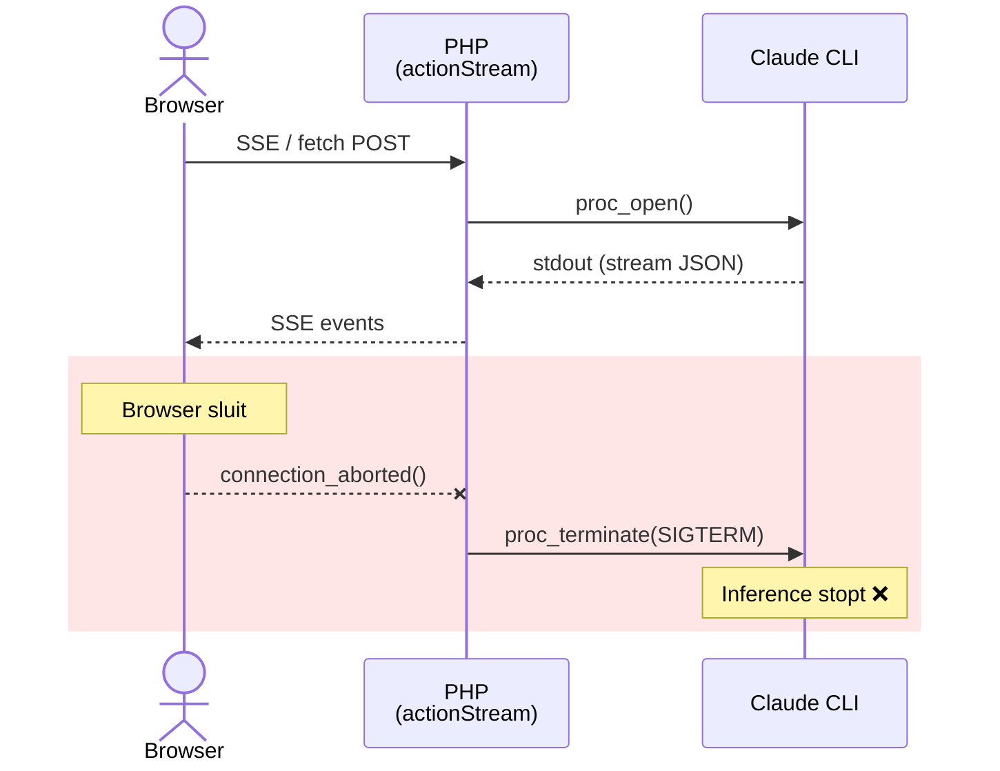
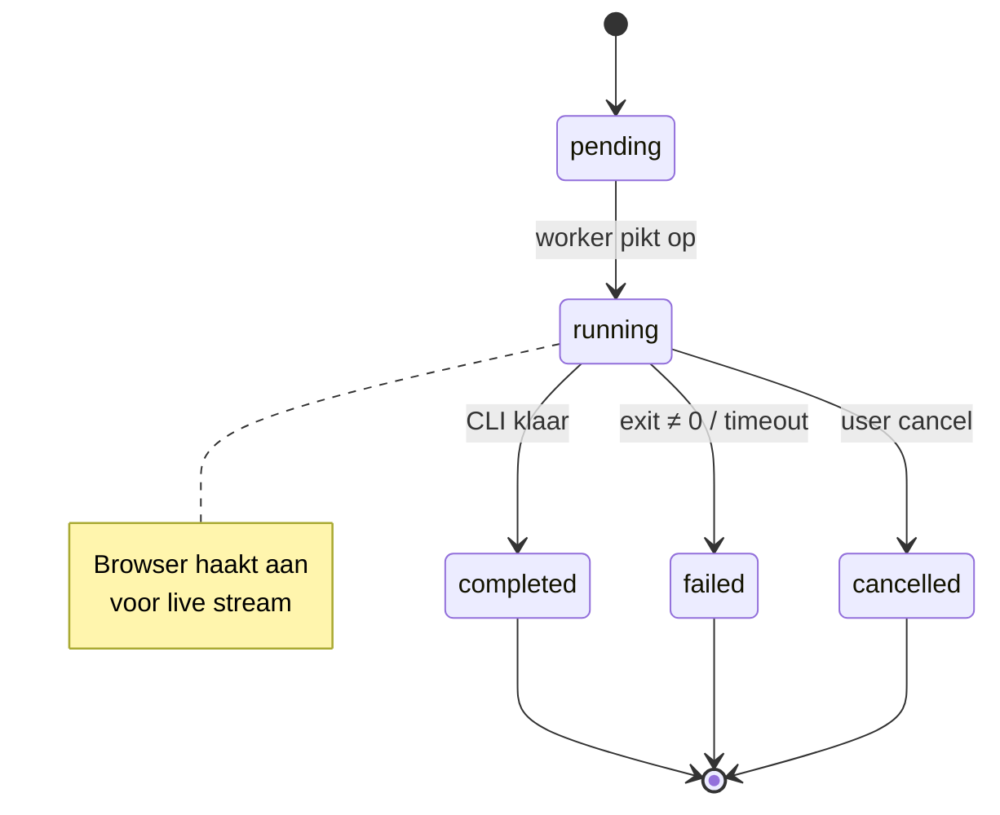

# Async Claude Inference — Functionele Specificatie

## Samenvatting

De Claude CLI inference draait volledig los van de browser-sessie. Sluiten van de browser of wegnavigeren onderbreekt de inference niet. Lopende en voltooide runs zijn per gebruiker opvraagbaar en hervaarbaar.

---

## Beslissingen

| Onderwerp | Beslissing | Rationale |
|-----------|-----------|-----------|
| Direct mode (`actionStream`) | **Volledig vervangen** door async flow | Twee paden = dubbele test-oppervlakte, geen UX-voordeel. Tijdelijk wrapper, daarna verwijderen. |
| Queue library | **`yii2-queue` met DB driver** | Standaard Yii2-patroon, ingebouwde retry/mutex, driver-agnostisch (later Redis). Eigen cron-oplossing hervindt hetzelfde wiel. |
| Docker worker | **Apart service `pma_queue`** in `docker-compose.yml` | Geheugen-isolatie, onafhankelijke restart policy, schaalbaar. Mac Mini 64 GB: ~50-80 MB per worker is verwaarloosbaar. |

---

## Huidige situatie (problemen)

### Architectuur nu



1. **PHP is de relay**: `ClaudeController::actionStream()` houdt een `proc_open`-process open en relay't stdout naar de browser via SSE.
2. **Browser = lifeline**: Als de browser sluit, detecteert PHP `connection_aborted()` en stuurt `SIGTERM` naar het CLI-process. De inference stopt.
3. **Geen persistentie**: De conversatie bestaat alleen in JavaScript-geheugen (`ClaudeChat.exchanges[]`). Sluit de browser = alles weg.
4. **Geen queue**: Er is geen background worker of job-systeem. Alles is synchroon binnen het HTTP-request.

### Gevolgen

- Gebruiker kan niet wegnavigeren tijdens een 30-60s+ inference
- Browser crash/refresh = verloren inference + verloren context
- Geen overzicht van lopende of recente runs
- Geen mogelijkheid om een run op een ander device te bekijken

---

## Gewenst gedrag

### Kernprincipes

1. **Fire-and-forget**: Gebruiker stuurt prompt, inference start op de server, browser mag sluiten
2. **Resume anywhere**: Gebruiker opent de pagina opnieuw (of ander device), ziet lopende/voltooide runs
3. **Per-user isolation**: Runs zijn alleen zichtbaar voor de eigenaar (`user_id`)
4. **Geen backward compatibility nodig**: `actionStream` (direct mode) wordt volledig vervangen

### Wat de gebruiker ziet

**Scenario A — Browser blijft open (happy path)**
1. Gebruiker typt prompt, klikt Send
2. Run wordt aangemaakt in de database (status: `pending`)
3. Background worker pikt de run op, status wordt `running`
4. Browser ontvangt streaming updates (zelfde SSE-ervaring als voorheen)
5. Run voltooid → status `completed`, resultaat opgeslagen in DB
6. Gebruiker ziet resultaat zoals voorheen

**Scenario B — Browser sluit tijdens inference**
1. Gebruiker stuurt prompt, ziet "Claude is thinking..."
2. Browser wordt gesloten (navigatie, crash, tab dicht)
3. Inference loopt door op de server (geen `connection_aborted()` kill)
4. Gebruiker opent de pagina opnieuw
5. Systeem toont: lopende run met indicator "Running..." OF voltooide run met resultaat
6. Als de run nog loopt: gebruiker kan live opnieuw aanhaken op de stream
7. Als de run klaar is: gebruiker ziet het volledige resultaat

**Scenario C — Overzicht van runs**
1. Gebruiker opent de Claude-pagina voor een project
2. Bovenaan ziet hij/zij een "Active runs" indicator als er iets loopt
3. Via een zijpanel of dropdown kan hij/zij recente runs zien:
   - Status (running / completed / failed / cancelled)
   - Starttijd, duur
   - Eerste regel van de prompt (samenvatting)
   - Project
4. Klikken op een run opent de volledige dialoog en haakt aan op de stream

---

## Domeinmodel

### Nieuwe entiteit: `ClaudeRun`

| Attribuut | Type | Beschrijving |
|-----------|------|-------------|
| `id` | int | Primary key |
| `user_id` | int | Eigenaar (FK → user) |
| `project_id` | int | Project context (FK → project) |
| `session_id` | string(191) | Claude CLI session ID (nullable tot eerste `system.init` event) |
| `status` | enum | `pending`, `running`, `completed`, `failed`, `cancelled` |
| `prompt_markdown` | longtext | De prompt zoals verstuurd naar Claude CLI |
| `prompt_summary` | varchar(255) | Korte samenvatting van de prompt (voor lijstweergave) |
| `options` | json | CLI opties (model, permissionMode, etc.) |
| `working_directory` | varchar(500) | Effectieve working directory |
| `stream_log` | longtext | NDJSON van alle stream events (volledige replay-mogelijkheid) |
| `result_text` | longtext | Eindresultaat (markdown tekst) |
| `result_metadata` | json | `{duration_ms, model, input_tokens, output_tokens, ...}` |
| `error_message` | text | Foutmelding bij `failed` status |
| `pid` | int | OS process ID (voor cancel, null als process klaar is) |
| `started_at` | datetime | Moment dat worker het oppikt |
| `completed_at` | datetime | Moment dat inference eindigt |
| `created_at` | datetime | Aanmaakmoment |
| `updated_at` | datetime | Laatste wijziging |

#### Statusovergangen



### Relaties

- `ClaudeRun` belongsTo `User`
- `ClaudeRun` belongsTo `Project`
- Conceptueel gekoppeld aan de Claude CLI session (via `session_id`), maar geen FK — sessions zijn extern (op het filesystem)

### Conversatie-koppeling

Een `ClaudeRun` vertegenwoordigt **een enkele turn** in een conversatie. Meerdere runs vormen een conversatie als ze dezelfde `session_id` delen (via `--resume`).

Voor het hervatten van een conversatie:
- De frontend stuurt `sessionId` mee (zoals nu)
- De nieuwe run krijgt dezelfde `session_id` en wordt een vervolg-turn

---

## Componenten

### 1. Background Worker — `yii2-queue` met DB driver

**Verantwoordelijkheid**: `ClaudeRun` records met status `pending` oppikken en de Claude CLI uitvoeren.

**Process-flow**:
1. Controller maakt `ClaudeRun` record aan (status: `pending`)
2. Controller pusht een `RunClaudeJob` naar de queue
3. Queue worker (apart Docker service `pma_queue`) pikt het job op
4. Job zet status naar `running`, start `ClaudeCliService::executeStreaming()`
5. `onLine` callback schrijft elke event naar stream-file op disk (append)
6. Na afloop: status → `completed`/`failed`, `result_text` + `result_metadata` ingevuld, `stream_log` bulk-geschreven naar DB

**Geheugenbeslag** (Mac Mini M4 64 GB):
- Worker idle: ~30-50 MB (PHP CLI + Yii2 bootstrap)
- Tijdens inference relay: +5-15 MB (stream buffer, file I/O)
- Piek: ~80 MB (verwaarloosbaar op 64 GB machine)
- `mem_limit: 256m` als vangnet

### 2. Stream Relay — File-based + SSE

**Verantwoordelijkheid**: Live stream events doorsturen naar verbonden browsers.

- Worker schrijft elke event regel-voor-regel naar een stream-file: `storage/claude-runs/{run_id}.ndjson`
- SSE endpoint opent het bestand, leest vanaf `offset`, stuurt nieuwe regels naar de browser
- Als het bestand niet bestaat (cleanup), fallback naar `stream_log` kolom in DB
- Geen extra infra (Redis), geen DB-druk bij snelle stream events
- Apple SSD: >3 GB/s read — file-based relay is zero-bottleneck

**SSE Reconnect flow**:
1. Browser opent SSE verbinding: `GET /claude/stream-run?runId=X&offset=0`
2. Server leest stream-file vanaf offset, stuurt alle bestaande events
3. Server blijft file pollen (100ms interval) voor nieuwe events
4. Als run `completed`/`failed`: stuurt `[DONE]`, sluit verbinding
5. Browser sluit en opent opnieuw: stuurt `offset=N` (waar het gebleven was)

### 3. Controller — Vervangt bestaande flow

#### Nieuwe actions op `ClaudeController`:

| Action | Method | Beschrijving |
|--------|--------|-------------|
| `actionStartRun` | POST | Maakt `ClaudeRun` aan, pusht job naar queue, retourneert `run_id` |
| `actionStreamRun` | GET | SSE endpoint dat stream events relay't voor een specifieke run |
| `actionCancelRun` | POST | Annuleert een lopende run (SIGTERM + status → cancelled) |
| `actionRunStatus` | GET | Retourneert status + metadata van een run (voor polling fallback) |
| `actionActiveRuns` | GET | Lijst van lopende/recente runs voor deze user + project |
| `actionRunHistory` | GET | Paginated lijst van alle runs (voor overzichtspagina) |

#### Te verwijderen actions (na migratie):

| Action | Reden |
|--------|-------|
| `actionStream` | Vervangen door `actionStartRun` + `actionStreamRun` |
| `actionRun` | Vervangen door `actionStartRun` (blocking mode niet meer nodig) |
| `actionCancel` | Vervangen door `actionCancelRun` (werkt op run record i.p.v. PID cache) |

**Migratiestrategie**: In de eerste iteratie wordt `actionStream` intern een wrapper die `actionStartRun` + `actionStreamRun` aanroept. Na validatie (1-2 weken) wordt de wrapper + oude code verwijderd.

### 4. Frontend — Twee-staps flow

#### Start flow wijziging

```
Voorheen:
  Send → POST /claude/stream → SSE direct

Nu:
  Send → POST /claude/start-run → { runId: 123 }
       → GET /claude/stream-run?runId=123&offset=0 → SSE (zelfde events)
```

De frontend verschilt minimaal:
- Eerste call is een POST die een `runId` teruggeeft
- Tweede call is een SSE stream die exact dezelfde events levert
- `ClaudeChat` slaat `runId` op naast `sessionId`

#### Reconnect bij pagina-herlaad

1. Bij laden van de Claude-pagina: `GET /claude/active-runs?p={projectId}`
2. Als er een `running` run is:
   - Toon indicator "Inference in progress..."
   - Open `GET /claude/stream-run?runId=X&offset=0` om aan te haken
   - Replay alle events die gemist zijn (offset 0 = vanaf begin)
3. Als er een recent `completed` run is die nog niet bekeken is:
   - Toon het resultaat in de chat

#### Runs overzicht

- Klein badge op de Claude-pagina: "2 active runs"
- Dropdown/panel met lijst van recente runs (max 10-20)
- Per run: status-icoon, promptsamenvatting, project, tijdstip
- Klik = laad die run in de chatweergave

---

## Edge Cases

### 1. Worker crash tijdens inference

**Wat**: Background worker process crasht (OOM, Docker restart).
**Effect**: `ClaudeRun` blijft op status `running`, CLI process is dood.
**Detectie**: Stale-run detector: als `updated_at` > 5 minuten oud EN status = `running` → markeer als `failed`.
**Mitigatie**:
- Worker schrijft `updated_at` elke 30 seconden als heartbeat
- Console command `claude-run/cleanup-stale` draait via cron (elke 5 min)
- Docker `restart: unless-stopped` herstart de worker automatisch

### 2. Meerdere runs tegelijk voor dezelfde user

**Wat**: Gebruiker stuurt een tweede prompt terwijl de eerste nog loopt.
**Beleid**: Toestaan. Elke run is onafhankelijk. De Claude CLI ondersteunt parallelle sessies.
**UI**: Actieve runs tellen badge, gebruiker kan switchen.
**Limiet**: Max 3 concurrent runs per user (voorkomt misbruik). Vierde poging geeft melding "Maximum concurrent runs reached."

### 3. Annulering na browser-sluiting

**Wat**: Gebruiker heeft run gestart, sluit browser, wil daarna annuleren.
**Oplossing**: Cancel-knop in het runs-overzicht. `actionCancelRun` stuurt SIGTERM naar het process (PID uit `claude_run` record).

### 4. Zeer grote stream_log

**Wat**: Lange inference (Opus, complex project) genereert duizenden stream events. `stream_log` kolom wordt meerdere MB.
**Mitigatie**:
- `stream_log` is LONGTEXT (max 4GB)
- Stream-file op disk is primaire bron; DB `stream_log` wordt pas bij completion geschreven (1x bulk insert)
- Cleanup: stream-files ouder dan 24 uur worden verwijderd
- `stream_log` in DB kan na 7 dagen genulled worden (resultaat blijft in `result_text`)

### 5. Session continuity over runs heen

**Wat**: Gebruiker stuurt follow-up prompt die moet aansluiten bij eerdere Claude sessie.
**Oplossing**: Frontend stuurt `sessionId` mee bij `actionStartRun`. De job geeft `--resume {sessionId}` door aan CLI. Nieuwe run krijgt eigen `id` maar deelt `session_id`.

### 6. Race condition: run start + stream connect

**Wat**: Browser stuurt `startRun`, krijgt `runId` terug, opent direct SSE. Worker heeft nog niet gestart.
**Oplossing**: SSE endpoint wacht max 10 seconden tot het stream-file verschijnt. Als het verschijnt, start relay. Als niet: stuurt `{"type":"waiting"}` events elke seconde zodat de browser weet dat het systeem actief is.

### 7. Concurrent SSE lezers op dezelfde run

**Wat**: Gebruiker opent dezelfde run in twee tabs.
**Beleid**: Beide tabs ontvangen dezelfde stream. Geen conflict — het stream-file is read-only voor de relay, append-only voor de worker.

### 8. PID geldigheid

**Wat**: PID in database verwijst naar een ander process (PID hergebruik door OS).
**Mitigatie**: Worker en webserver draaien in aparte containers. PID-namespace is per container geïsoleerd. Binnen de `pma_queue` container is de kans op PID collision minimaal (weinig processen). Extra check: verifieer `/proc/{pid}/cmdline` bevat "claude".

### 9. Bestandspermissies stream-files

**Wat**: Worker (`pma_queue`) en webserver (`pma_yii`) zijn aparte containers.
**Oplossing**: Gedeelde Docker volume voor `storage/`. Beide containers draaien als dezelfde user (via `USER_ID` build arg). `umask(0002)` zorgt voor group-writable files.

### 10. Mac Mini specifiek: Docker Desktop geheugendruk

**Wat**: Docker Desktop op macOS heeft een VM overhead (~2-4 GB). Extra container voegt toe.
**Mitigatie**: `pma_queue` worker heeft `mem_limit: 256m`. Totale overhead is ~80 MB idle + 256 MB cap. Op een 64 GB machine is dit irrelevant (<0.5%).

---

## Validatie & Beveiliging

### RBAC

- `ClaudeRun` heeft `user_id` — alle queries filteren op eigenaar
- Nieuwe owner rule: `ClaudeRunOwnerRule` (controleert `user_id`)
- `actionStreamRun`, `actionCancelRun`, `actionRunStatus` vereisen eigenaarschap
- `actionActiveRuns`, `actionRunHistory` filteren automatisch op `user_id`

### Input validatie

- `prompt_markdown`: verplicht, niet leeg
- `project_id`: moet bestaan en eigendom zijn van de user
- `options`: whitelist van toegestane keys (model, permissionMode, etc.)
- `runId`: integer, moet bestaan en eigendom zijn van de user
- `offset` (voor stream): non-negative integer

### Concurrency limiet

- Max 3 `running` runs per user (tel bij `actionStartRun`)
- Geeft HTTP 429 met duidelijke melding als limiet bereikt

### Cleanup

- Stream-files: verwijderd na 24 uur via cron job
- `stream_log` in DB: genulled na 7 dagen (configureerbaar)
- `ClaudeRun` records: bewaard voor audit (geen auto-cleanup)

---

## Acceptatiecriteria

### AC1 — Run overleeft browser-sluiting
- [ ] Gebruiker start run, sluit browser, opent opnieuw: run is nog bezig of klaar
- [ ] Resultaat is volledig beschikbaar na hervatten
- [ ] Geen data verlies door browser-sluiting

### AC2 — Live aanhaken op lopende run
- [ ] Gebruiker opent pagina, ziet lopende run, klikt erop
- [ ] Stream events verschijnen real-time (zelfde ervaring als voorheen)
- [ ] Gemiste events worden gereplayd (offset-mechanisme)

### AC3 — Runs overzicht per user
- [ ] Lijst van recente runs zichtbaar (status, prompt-samenvatting, tijdstip)
- [ ] Alleen eigen runs (user_id filter)
- [ ] Status updates zijn actueel (polling of real-time)

### AC4 — Annulering
- [ ] Lopende run kan geannuleerd worden via UI
- [ ] CLI process wordt daadwerkelijk gestopt (SIGTERM → SIGKILL)
- [ ] Status wordt `cancelled`, partial output bewaard

### AC5 — Concurrency limiet
- [ ] Max 3 parallelle runs per user
- [ ] Duidelijke melding bij overschrijding
- [ ] Voltooide runs tellen niet mee

### AC6 — Stale run detectie
- [ ] Run die >5 minuten geen heartbeat heeft → `failed`
- [ ] Gebruiker ziet foutmelding, niet eindeloos "running"

### AC7 — Direct mode verwijderd
- [ ] `actionStream`, `actionRun`, `actionCancel` zijn verwijderd na migratieperiode
- [ ] Alle bestaande features werken via het async pad
- [ ] Session continuity (--resume) werkt over async runs heen
- [ ] Bestaande ScratchPad save-flow werkt met async runs

### AC8 — Data-eigenaarschap (RBAC)
- [ ] User A kan runs van user B niet zien/aanpassen/annuleren
- [ ] Alle endpoints checken eigenaarschap

---

## Scope-afbakening

### In scope
- Nieuwe `claude_run` tabel + model + migration
- Background worker met `yii2-queue` (DB driver), apart Docker service
- File-based stream relay met SSE endpoint
- Start/cancel/status/history endpoints
- Frontend: twee-staps flow (start + stream), reconnect, runs overzicht
- Verwijdering van `actionStream`/`actionRun`/`actionCancel` (na migratieperiode)
- Stale-run cleanup command
- Concurrency limiet (max 3)

### Buiten scope (toekomstig)
- Webhook/notificatie bij voltooiing (Slack, email)
- Run scheduling (uitgestelde start)
- Run prioritering
- Shared runs (andere user mag meekijken)
- Export van run-history
- Redis queue driver (start met DB driver)
- Run retry mechanisme

---

## Migratie-impact

### Database
- Nieuwe tabel: `claude_run` (17 kolommen)
- Nieuwe tabel: `queue` (yii2-queue DB driver)
- Geen wijzigingen aan bestaande tabellen

### Infra
- `composer require yiisoft/yii2-queue` (DB driver)
- Nieuw Docker service `pma_queue` in `docker-compose.yml`
- Cron job voor stale-run cleanup (in `pma_queue` of `pma_yii`)
- Storage directory: `storage/claude-runs/` (gedeeld volume)
- Geheugenimpact: ~80 MB idle, max 256 MB (cap)

### Risico's
- yii2-queue DB driver poll interval (1-3s latentie) — acceptabel, later Redis
- Extra Docker service = extra process — verwaarloosbaar op 64 GB machine
- File I/O op Docker Desktop macOS (VirtioFS) — Apple SSD maakt dit verwaarloosbaar
