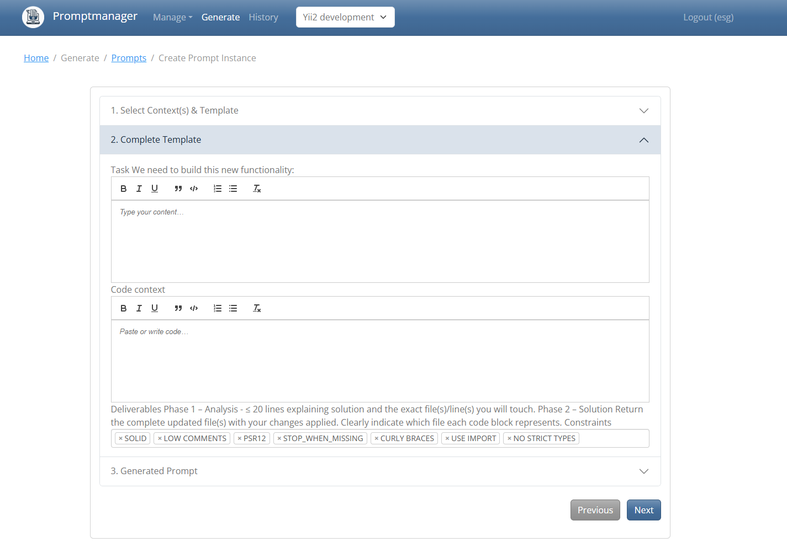

# PromptManager

A web-based prompt management system built with **Yii2**, **MySQL**, and a Bootstrap-powered UI.

PromptManager organizes prompts into projects, contexts, fields, and reusable templates so teams can assemble high-quality LLM prompts without copy/paste sprawl.



---

## Features

- **Project-aware prompt library**
    - Projects contain contexts (background, instructions) and prompt templates.
    - Fields and field options capture structured inputs for each template.
    - Prompt instances merge a template, context, and field values into a finalized prompt.
- **Role-based permissions (RBAC)**
    - Built-in RBAC rules for projects, contexts, fields, templates, and prompt instances.
    - Console initializer to seed permissions and assign default roles.
- **User management**
    - Identity module with login, signup, and optional test user seeding.
    - Remember-me sessions and long-lived auth timeouts for power users.
- **Frontend build pipeline**
    - NPM bundle for Quill assets (`npm/` → `yii/web/quill`).
    - Ready-to-use Dockerized Node builder.
- **Containerized local stack**
    - Docker services for PHP-FPM/Yii, Nginx, MySQL, and Node build tools.
    - Environment-driven ports and credentials for easy overrides.

---

## Requirements

- PHP **8.2+** with Composer (inside Docker image or host)
- MySQL **8.x** (Docker service `pma_mysql` by default)
- Node.js (via the `pma_npm` container) for building frontend assets
- Git
- Recommended OS: Linux, macOS, or Windows with **Git Bash**
- Environment variables (see `.env.example`):
    - `DB_HOST`, `DB_DATABASE`, `DB_USER`, `DB_PASSWORD`, `DB_PORT`
    - `NGINX_PORT`, `PHP_FPM_PORT`, `TIMEZONE`, `XDEBUG_PORT`, `XDEBUG_CLIENT_HOST`
    - `IDENTITY_DISABLE_CAPTCHA`, `INCLUDED_TEST_MODULES`

---

## Installation

### 1) Clone the repository

```bash
git clone https://github.com/efhsg/promptmanager.git
cd promptmanager
```

### 2) Copy and edit environment variables

```bash
cp .env.example .env
# Update DB_* and port settings as needed
```

### 3) Install PHP dependencies

Using Docker (recommended):

```bash
docker compose run --entrypoint bash pma_yii -c "composer install"
```

On host (if PHP 8.2+ and extensions are available):

```bash
cd yii
composer install
```

### 4) Build frontend assets (optional for dev)

```bash
docker compose run --entrypoint bash pma_npm -c "npm run setup"
docker compose run --entrypoint bash pma_npm -c "npm run build-and-minify"
```

---

## Configuration

- Global parameters live in `yii/config/params.php` with RBAC definitions in `yii/config/rbac.php`.
- Database connection uses environment variables read in `yii/config/db.php`:

```php
return [
    'class' => 'yii\\db\\Connection',
    'dsn' => sprintf('mysql:host=%s;port=%s;dbname=%s', getenv('DB_HOST'), 3306, getenv('DB_DATABASE')),
    'username' => getenv('DB_USER'),
    'password' => getenv('DB_PASSWORD'),
    'charset' => 'utf8',
];
```

- Web configuration merges `yii/config/main.php` and `yii/config/web.php`; console uses `yii/config/console.php`.
- Set `IDENTITY_DISABLE_CAPTCHA=TRUE` in `.env` to simplify local logins.

---

## Database

- Default containerized MySQL credentials are defined in `.env.example` (`DB_DATABASE=promptmanager`, `DB_USER=promptmanager`, `DB_PASSWORD=promptmanager`).
- Run migrations after Composer install:

```bash
docker exec pma_yii yii migrate --migrationPath=@app/modules/identity/migrations --interactive=0 && \
  docker exec pma_yii yii_test migrate --migrationPath=@app/modules/identity/migrations --interactive=0

docker exec pma_yii yii migrate --migrationNamespaces=app\\migrations --interactive=0 && \
  docker exec pma_yii yii_test migrate --migrationNamespaces=app\\migrations --interactive=0 && \
  docker exec pma_yii yii migrate --migrationPath=@yii/log/migrations/ --interactive=0

docker exec pma_yii yii migrate --migrationPath=@yii/rbac/migrations --interactive=0 && \
  docker exec pma_yii yii rbac/init && \
  docker exec pma_yii yii_test migrate --migrationPath=@yii/rbac/migrations --interactive=0
```

- Initialize RBAC rules with `docker exec pma_yii yii rbac/init` (included above).

---

## Quick Start

Linux/macOS/Windows (Git Bash):

```bash
# From project root
cp .env.example .env

# Start containers
docker compose up -d

# Install PHP dependencies
docker compose run --entrypoint bash pma_yii -c "composer install"

# Run migrations and seed RBAC (once)
docker exec pma_yii yii migrate --migrationPath=@app/modules/identity/migrations --interactive=0 && \
  docker exec pma_yii yii_test migrate --migrationPath=@app/modules/identity/migrations --interactive=0

docker exec pma_yii yii migrate --migrationNamespaces=app\\migrations --interactive=0 && \
  docker exec pma_yii yii_test migrate --migrationNamespaces=app\\migrations --interactive=0 && \
  docker exec pma_yii yii migrate --migrationPath=@yii/log/migrations/ --interactive=0

docker exec pma_yii yii migrate --migrationPath=@yii/rbac/migrations --interactive=0 && \
  docker exec pma_yii yii rbac/init && \
  docker exec pma_yii yii_test migrate --migrationPath=@yii/rbac/migrations --interactive=0

# (Optional) Build frontend assets
 docker compose run --entrypoint bash pma_npm -c "npm run build-and-minify"

# Create a default user (or sign up via UI)
docker exec -it pma_yii bash -c "yii identity/user/create user user@user.com user"

# Access the app
open http://localhost:8503/
```

The Nginx container proxies to PHP-FPM on `PHP_FPM_PORT`; adjust `NGINX_PORT` in `.env` if you need a different host port.

---

## CLI Workflow

Useful console commands (inside the `pma_yii` container):

```bash
# Create a user
yii identity/user/create <username> <email> <password>

# Initialize RBAC
yii rbac/init
```

---

## Web UI Workflow

1. Sign in (or create a user) at `http://localhost:8503/`.
2. Create a **Project** and set it as current.
3. Add **Contexts** to capture background instructions for the project.
4. Define **Fields** and **Field Options** for reusable prompt inputs.
5. Build **Prompt Templates** that reference fields.
6. Create **Prompt Instances**, fill field values, and generate the final prompt for copy/paste into your LLM workflow.

---

## Architecture Overview

```text
Users (Identity module) --> RBAC (roles: user/admin)
         |                        |
         v                        v
      Projects ------------> Contexts
         |                     |
         v                     v
       Fields <----- TemplateFields ---- PromptTemplates
         |                                   |
         v                                   v
    FieldOptions                        PromptInstances
         \____________________________________/
                          |
                    Generated Prompt
                          |
                        MySQL
```

---

## Components

- **Models:** `Project`, `Context`, `Field`, `FieldOption`, `PromptTemplate`, `TemplateField`, `PromptInstance`, `PromptInstanceForm`, `UserPreference`.
- **Services:** `ProjectService`, `FieldService`, `PromptTemplateService`, `ModelService`, `EntityPermissionService`, `UserPreferenceService`.
- **Identity module:** user management, auth, and RBAC rules located in `yii/modules/identity`.
- **Console controllers:** `yii/commands/RbacController.php`, `yii/modules/identity/commands/UserController` for user creation.
- **Web entry:** `yii/web/index.php` served via Nginx → PHP-FPM.

---

## Development

- Start/stop stack: `docker compose up -d` / `docker compose down`.
- Run migrations: use the commands in the **Database** section (include `yii_test` for test DB).
- Serve locally without Docker (requires PHP 8.2+, MySQL DSN configured):

```bash
cd yii
php yii serve --docroot=@app/web --port=8080
```

Open `http://localhost:8080/` when running the built-in server.

---

## Troubleshooting

- **DB connection errors**: verify `DB_HOST`, `DB_DATABASE`, `DB_USER`, `DB_PASSWORD`, and that `pma_mysql` is running (`docker ps`).
- **Migrations not found**: ensure the `@app/modules/identity/migrations` and `app\migrations` paths are included as in the migration commands above.
- **Permission denied on assets/runtime**: ensure Docker volume mounts allow writes or run `chmod -R 777 yii/runtime yii/web/assets` in development.
- **RBAC not initialized**: rerun `docker exec pma_yii yii rbac/init`.
- **Captcha blocking login locally**: set `IDENTITY_DISABLE_CAPTCHA=TRUE` in `.env`.
- **Xdebug not connecting**: run `scripts/test_xdebug_ip.sh` to compare the current host IP with `.env` and test connectivity from `pma_yii` to your IDE port.

---

## License

PromptManager is distributed under the **BSD-3-Clause** license (matching the Yii2 template). Please see the project metadata for details.
